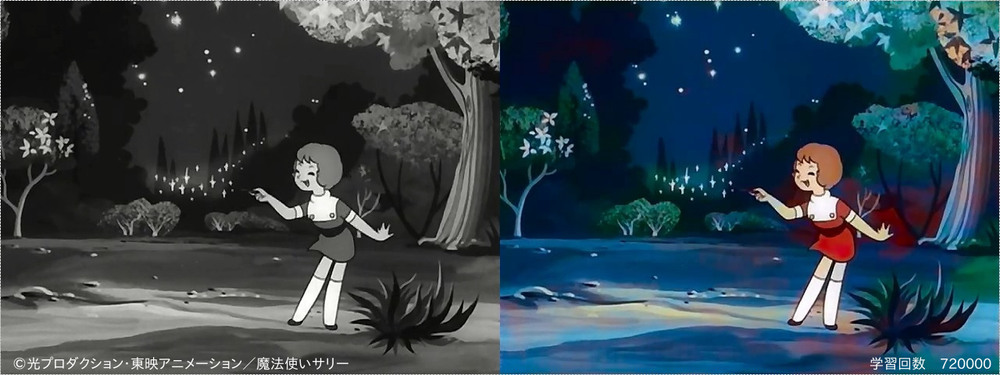
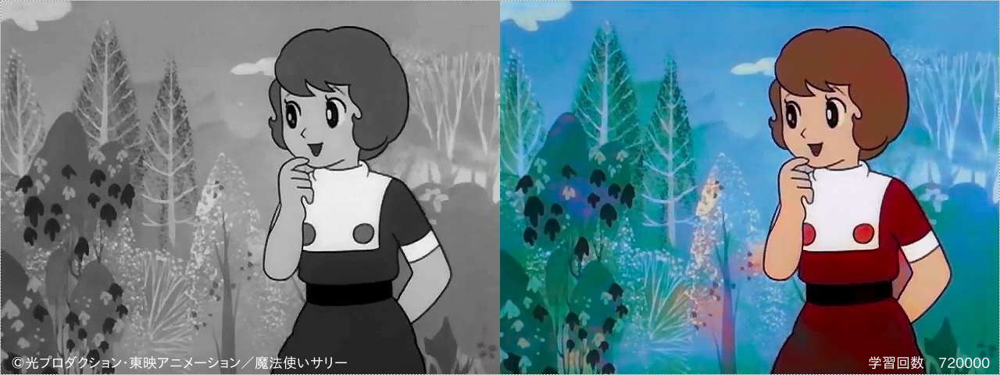
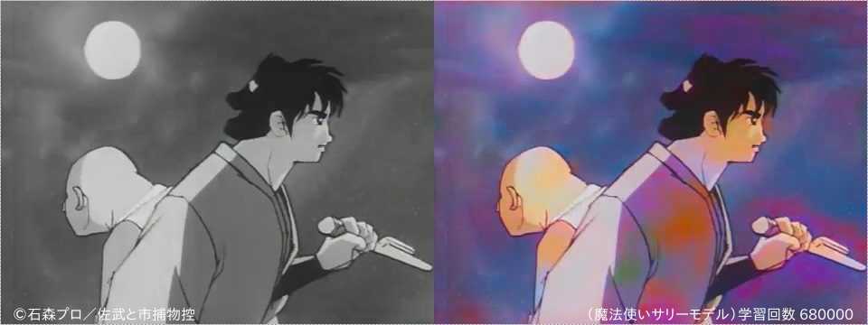
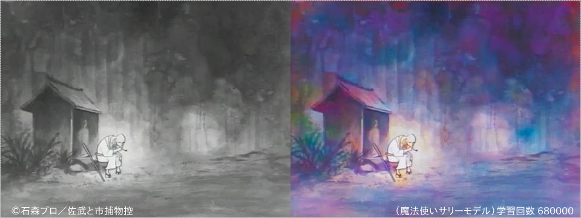
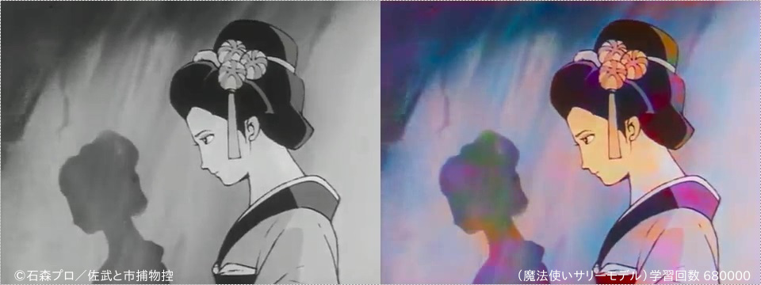
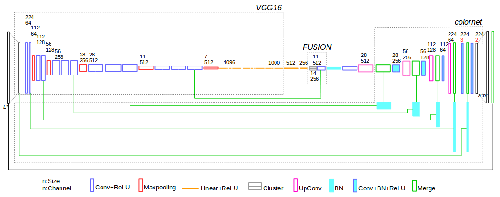

# mahalita  
## ディープラーニングによる白黒アニメの自動彩色実験　by Chainer  









### ネットワーク構造


## 実験動画

####  魔法使いサリーOP＋第１話ダイジェスト （複数モデル）
魔法使いサリーカラー放送（18～23話）　複数学習モデル使用による自動彩色  
　　オープニング→カラー放送オープニング学習モデル  
　　本編以降→カラー放送（18～23話）学習モデル（複数）  
[](https://youtu.be/z-HjyQh6nAA)  
©光プロダクション・東映アニメーション


####  魔法使いサリーOP＋第１話ダイジェスト （単体モデル）
魔法使いサリーカラー放送（18～23話）学習モデル（680Kイテレータ）による自動彩色
[](https://youtu.be/V8AjYjXxno0)  
©光プロダクション・東映アニメーション


####  佐武と市捕物控　三匹の狂犬（後半）＋OP （単体モデル）
魔法使いサリーカラー放送（18～23話）学習モデル（680Kイテレータ）による自動彩色
[](https://youtu.be/ocU7x-LTvCw)  
©石森プロ
## 実験環境
* Chainer 1.8.2   
* python 2.7.6
* OpenCV 3.0.0  

## 導入
1. mahalita.pyをダウンロード

2. VGGモデルの入手  
[chainer-imagenet-vgg (by Shunta Saito)](https://github.com/mitmul/chainer-imagenet-vgg)から、学習済みVGGネットモデル（[CaffeによるILSVRC-2014データセット学習済みVGG16モデル](https://gist.github.com/ksimonyan/211839e770f7b538e2d8#file-readme-md)をChainer用に変換したもの）を入手する。mahalitaと同フォルダに保存。  

  ```
 wget https://www.dropbox.com/s/oubwxgmqzep24yq/VGG.model?dl=0 -O VGG.model
 ```

## 使用方法
```
python mahalita.py 入力動画ファイル.mp4 出力動画ファイル.mp4 --オプション
```

#### 学習
```
python mahalita.py 学習動画ファイル.mp4 学習過程動画ファイル.mp4 --epoch 1000 --mon
```
 --epoch 学習動画再生回数  
 --mon 監視画面表示

#### 彩色
 ```
 python mahalita.py 白黒動画ファイル.mp4 彩色動画ファイル.mp4 --test --load 680000 --mon
 ```
 --test 検証（彩色）  
 --load モデルファイルロード（モデルファイルイテレーション数を指定）

#### 追加学習
 ```
 python mahalita14w.py 学習動画ファイル.mp4 学習過程動画ファイル.mp4 --epoch 1000 --load 680000 --mon
 ```

#### その他オプション
--parm     SDG学習パラメータ（デフォルト0.0002）  
--gpu      GPU使用（デフォルト）  
--savestep モデルファイル保存間隔（デフォルト10,000イテレータ間隔）  
--log      ログ出力間隔（デフォルト100イテレータ間隔）  
--fast     学習処理の高速化（学習過程動画ファイル作成と監視画面表示の無効化）  
--file     モデルファイル名指定（デフォルト'mahalita10', フォルダ指定可）  

## 参照
* [Ryan Dahl, Automatic Colorization](http://tinyclouds.org/colorize/)
* [Pavel Gonchar, colornet](https://github.com/pavelgonchar/colornet/blob/master/README.md)  
* [Satoshi Iizuka, Edgar Simo-Serra, and Hiroshi Ishikawa, Let there be Color!](http://hi.cs.waseda.ac.jp/~iizuka/projects/colorization/en/)  
* [mitmul, chainer-imagenet-vgg](https://github.com/mitmul/chainer-imagenet-vgg)

## 使用条件
### 　　非商用

## ブログ
http://www.eiji-k.com/entry/2016/11/14/235719
